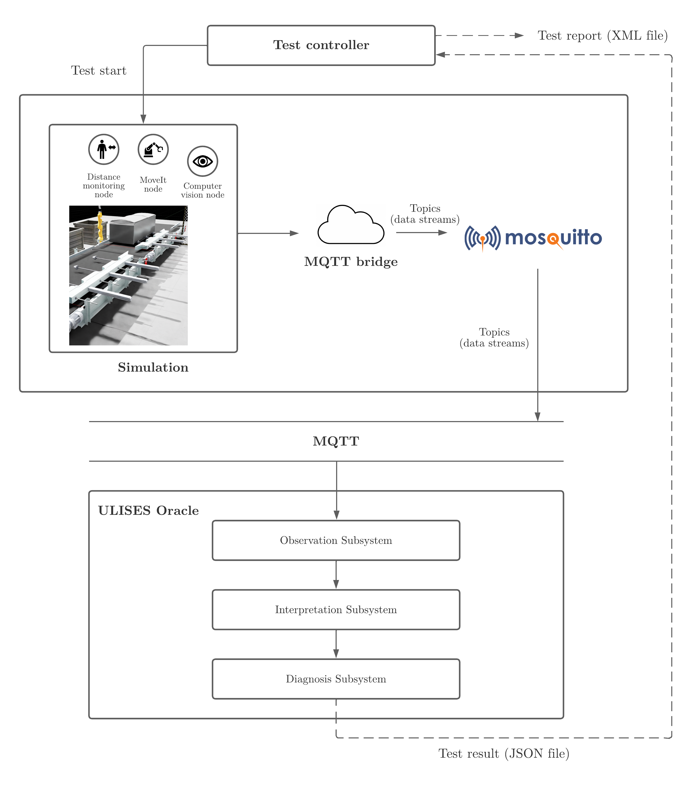
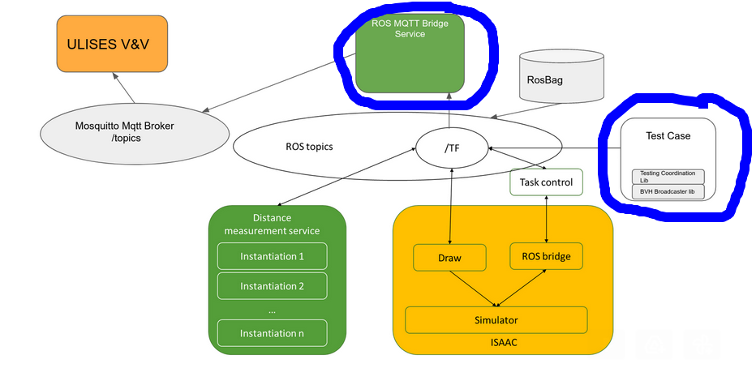
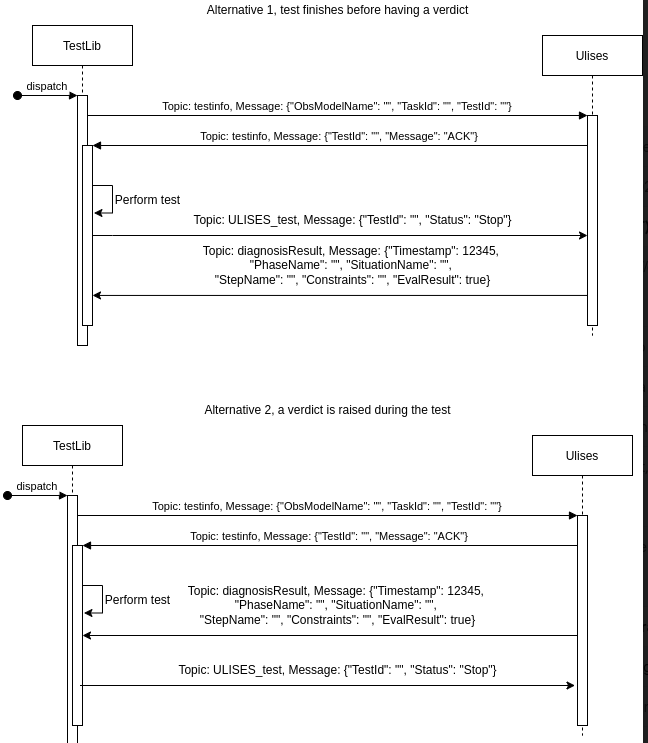

# VALU3S UC7 WORKSPACE

UC7 demonstrator shows how to coordinate simulation-based testing activity in human-robot collaborative environments. The VALU3S UC7 demonstrator  provides a real-time, automated verdict of test execution of simulation environments through constrained based-oracles using Simulation-Based Testing for Human-Robot Collaboration. The aim of this repository is to provide a ROS workspace that coordinates the execution of a ROS system test suite with the evaluation of the oracle in simulation-based Human-robot collaboration environments. This tool provides real-time and automated verdict of test execution of simulation environments through oracles. To coordinate the testing with the Constrained-Based Oracle [ULISES],  leverages a ROS package to seamlessly align the execution of the test, the simulation environment, and the oracle. In the next image the execution flow is shown:




This ROS workspace has several  TEST CASEs  for the VALU3S UC7 project.In practice, each test case is executed through a dedicated ROS launch file that orchestrates the full experiment. This file ensures that all required components are initialized in a consistent and reproducible manner. Specifically, each launch file starts the System Under Test (SUT), the Isaac Sim simulator, the ROS–MQTT bridge, and the additional monitoring nodes (distance calculation, motion planning with MoveIt, and computer vision). The inclusion of these elements guarantees that every test begins in a controlled environment, independently of previous executions.

The ROS–MQTT bridge plays a crucial role in enabling communication between the ROS-based simulation and the ULISES oracle. Its configuration is specified through a YAML file, where each mapping explicitly defines which ROS topics are translated into MQTT messages and vice versa. In our use case, all relevant robot and environment signals are published: conveyor commands and states, fridge door states, robot joint states, and human–robot distance estimations. These are serialized in JSON format and transmitted to an MQTT broker, from which ULISES consumes the data. This setup allows ULISES to observe the ongoing simulation in real-time according to the observation model provided at the start of the test.

On the testing side, every test case is implemented as a Python unit test using the standard unittest library. To coordinate with ULISES, we developed a lightweight API (UlisesTestHelper) that handles the synchronization protocol. At the beginning of a test, the developer instantiates a TestLaunchInfo object, which specifies the observation model (XML), task identifier, and test identifier. The helper then establishes an MQTT session with ULISES, sends a TEST_START message, and waits for diagnostic feedback. During the test execution, the SUT is commanded through ROS interfaces (e.g., activating pistons, conveyors, robot motions, and fridge doors), while BVH animations are broadcast to simulate human motion. Once the test sequence finishes, the helper waits for an assertion from ULISES (ASSERT or TEST_ERROR). This diagnostic result is used directly as an assert in the Python test, ensuring that verification is automated and tightly integrated with the simulation.


## Exceution details

In this section, we provide more technical details on how the test cases are executed and integrated within the ROS ecosystem. Previous too the rostest launch the ULISES Oracle must be launched. Once ULISES is running, the rostest can be launched.In practice, each test case is executed through a dedicated ROS launch file that orchestrates the full experiment. This file ensures that all required components are initialized in a consistent and reproducible manner. Specifically, each launch file starts the System Under Test (SUT), the Isaac Sim simulator, the ROS–MQTT bridge, and the additional monitoring nodes (distance calculation, motion planning with MoveIt, and computer vision). The inclusion of these elements guarantees that every test begins in a controlled environment, independently of previous executions.


### ROS Launch Orchestration

Each test is defined in a .launch file executed by rostest. This file initializes the simulator, the SUT, and the MQTT bridge:

```xml
<launch>
  <!-- Enable simulation clock -->
  <param name="/use_sim_time" value="true" />

  <!-- Start Isaac Sim and environment -->
  <include file="$(find simulation)/launch/default.launch"/>

  <!-- Start MQTT bridge -->
  <include file="$(find mqtt_bridge)/launch/demo.launch"/>

  <!-- Launch distance monitoring and robot planning -->
  <include file="$(find skros_service_tf_distance)/launch/default_demo.launch"/>
  <include file="$(find iiwa_moveit_config)/launch/default.launch"/>

  <!-- Execute the tests -->
  <test test-name="uc7_func_normal" pkg="valu3s_uc7" type="test_uc7_func_normal.py"/>
  <test test-name="uc7_door_not_opening" pkg="valu3s_uc7" type="test_uc7_door_not_opening.py"/>
</launch>
```

### ROS–MQTT Bridge Configuration

The bridge is configured with a YAML file, which specifies how ROS topics are translated into MQTT messages. For example:

```yaml
mqtt:
  connection:
    host: 172.17.6.163
    port: 1883
  serializer: json:dumps
  deserializer: json:loads
bridge:
  # Conveyor state
  - factory: mqtt_bridge.bridge:RosToMqttBridge
    msg_type: sensor_msgs.msg:JointState
    topic_from: /conveyor_00/joint_states
    topic_to: conveyor_00_joint_states

  # Fridge doors
  - factory: mqtt_bridge.bridge:RosToMqttBridge
    msg_type: sensor_msgs.msg:JointState
    topic_from: /fridge_00/joint_states
    topic_to: fridge_00_joint_states

  # Human–robot distance
  - factory: mqtt_bridge.bridge:RosToMqttBridge
    msg_type: std_msgs.msg:Float64
    topic_from: /human_dist_neck2gripper
    topic_to: human_dist_neck2gripper
```
### Python Test Integration

Each test is implemented with unittest and synchronized with ULISES through the UlisesTestHelper API:

```python
from valu3s_uc7.ulises_test_utils.test_utils import (
    TestLaunchInfo, UlisesTestHelper
)

class FridgeDisassemblyTest(unittest.TestCase):
    def test_fridge_disassembly(self):
        # Define test metadata
        test_info = TestLaunchInfo(
            observation_model_name='FridgeDisassemblyOM.xml',
            task_id='3ef9c5db-630d-4537-b30c-95831447aeb6',
            test_id='1'
        )

        # Synchronize with ULISES
        with UlisesTestHelper(mqtt_host="172.17.6.163", test_launch_info=test_info) as helper:
            # Interact with the SUT
            task.control_piston("pistons_01", True)
            task.control_conveyor("conveyor_00", True)
            task.control_fridge_doors("fridge_00", ["up", "down"], True)

            # Wait for diagnostic assertion from ULISES
            helper.wait_assert_passed()
```
### Rostest Execution commands
It is required to install Ros Melodic in the machine where the tests are going to be executed.

```bash
git clone https://gitlab.danz.eus/hazi/proiektuak/valu3s/valu3s_uc7
cd valu3s_uc7/src/valu3s_uc7

rostest valu3s_uc7 test_uc7_ulises_fake_result.test 
- test_uc7_func_normal_ulises_fake_result.py
- test_uc7_door_not_openning_ulises_fake_result.py

rostest valu3s_uc7 test_dana_2.test 
  - test_uc7_bat.py
  - test_uc7_bi.py

rostest valu3s_uc7 test_uc7.test 
-  test_uc7_func_normal.py
- test_uc7_door_not_opening.py

rostest valu3s_uc7 test_uc7_door_not_openning.test 
- test_uc7_door_not_opening.py

```

## Step by step execution of a test case without rostest

The actual test case consists of two elements:

1. A ROS MQTT BRIDGE that allows sending ROS topics to the ULISES V&V oracle tool
2. A test case example that uses the Test Coordination library to communicate with ULISES via MQTT and sends a human motion defined in BVH to ROS /tf topics using BVH_Broadcaster.



## How to run the simulation from a Windows PC

1. On the Windows PC, open five CMD or PowerShell windows
2. Connect to the docker environment in each window

```bash
ssh root@172.17.6.97 -p 12224
password: root
```
3. Prepare for the simulation: go to the folder and set up (in all CMD windows)
```bash
cd /isaac-sim/VALU3S/valu3s_uc7
source /opt/ros/melodic/setup.bash
source devel/setup.bash
```
4. Manually launch the simulation in the 1st window
```bash
cd /isaac-sim   
export ACCEPT_EULA=Y
./runheadless.native.sh
```
5. Launch the MQTT bridge in the 2nd window
```bash
roslaunch mqtt_bridge demo.launch 
```
6. Launch the distance service in the 3rd window
```bash
roslaunch skros_service_tf_distance default_demo.launch
```
7. On the Windows PC

Download Omniverse launcher https://www.nvidia.com/en-us/omniverse/download/ and install Omniverse Streaming Client from the Exchange tab

In Omniverse Stream Client connect to: 172.17.6.97

Open the file /isaac-sim/VALU3S/valu3s_uc7/src/simulation/assets/ros.usd and play the simulation.

In Windows, Robotics, TF Viewer, you can choose how to view the elements of the world. BUT DO NOT DO THIS until the test is running, otherwise the person is not published correctly and is not visible in the TFs in the recorded rosbags.

8. Launch the robot MoveIt config in the 4th window
```bash
roslaunch iiwa_moveit_config default.launch
```

9. Launch the task (SUT) in the 5th window
```bash
# roslaunch task default.launch
rosparam set /use_sim_time true 
python src/valu3s_uc7/test/test_fridge_dissasembly.py FridgeDisassemblyTest.test_uc7
```

## Docker environment

```
Host isaac_sim_1
    HostName 172.17.6.97
    User root
    Password root
    Port 12224
```

## Deploy

```bash
git clone https://gitlab.danz.eus/hazi/proiektuak/valu3s/valu3s_uc7.git
cd valu3s_uc7
catkin_make
source devel/setup.sh
roslaunch 
```


## Development

It is recommended to use the ADE environment.

```bash
git clone https://gitlab.danz.eus/hazi/proiektuak/valu3s/valu3s_uc7.git
cd valu3s_uc7
catkin_make
source devel/setup.sh
roslaunch simulation default.launch
roslaunch mqtt_bridge demo.launch (requires connection to an MQTT server)
# rosrun tf static_transform_publisher 0 0 0 0 0 0 1  map world 50
rosrun rviz rviz
rosrun valu3s_uc7 froga.py src/valu3s_uc7/data/door_opening.bvh world
roslaunch skros_service_tf_distance default.launch
```

## Developing a test case

This section describes how a test case should be developed under VALU3S_UC7. The actual test case consists of two elements:

```bash
ulises@ade:~/valu3s_uc7$ python -m unittest discover src/valu3s_uc7/test/
```

1. A ROS MQTT BRIDGE that allows sending ROS topics to the ULISES V&V oracle tool
2. A test case example that uses the Test Coordination library to communicate with ULISES via MQTT and sends a human motion defined in BVH to ROS /tf topics using BVH_Broadcaster.

Test Coordination library sequence diagram.  


```bash
mosquitto_sub -t '#'
```

## Dependencies

In the ADE environment add the following external libraries:
```bash
sudo apt update
sudo apt install python-pip
sudo apt install python3-pip
pip install mock
pip install paho-mqtt
pip3 install rospkg
apt install ros-melodic-rosbridge-library
apt install ros-melodic-tf
```

## RECORD ROSBAG AND PLAY

When running a test, you can record a rosbag:
```bash
rosbag record -a -O nameFile.bag
```
To stop recording use Control C and not Control Z (otherwise the rosbag will not close properly).

To delete, you can use ls to list the files and then delete the incorrect bag:
```bash
rm nameFile.bag
```

Once you have the rosbag files, copy them from the machine where they were recorded to the development machine (but not from inside ADE):
```bash
mkdir rosbag
cd rosbag/
scp -P 12224 root@172.17.6.97:/isaac-sim/VALU3S/valu3s_uc7/filename.bag .
```

Once you have copied the rosbag files, you can play them and view them in rviz.
In the development environment (NoMachine VALU3S_Environment with ADE environment) in each screen used, do the following:
```bash
ade enter
source /opt/ros/melodic/setup.bash
```

1) In one terminal run roscore:
```bash
roscore
```

2) In another terminal publish the reference to the world:
```bash
rosrun tf static_transform_publisher 0 0 0 0 0 0 1  map world 50
```

3) In another terminal play the rosbags. Add -l to play in a loop:
```bash
rosbag play -l nameFile.bag
```

4) In another terminal run rviz to view the bag file playback:
```bash
rosrun rviz rviz
```
And in the graphical interface add the TFs to view them.

## PLAY ROSBAGS AND PUBLISH INTO MQTT_BRIDGE

In the development environment (NoMachine VALU3S_Environment with ADE environment) in screens 1-4 do the following:
```bash
ade enter
source /opt/ros/melodic/setup.bash
```

1) In one terminal run mqtt_bridge and specify the use of simulation time beforehand, otherwise it will not be sent correctly
```bash
rosparam set /use_sim_time true
roslauunch mqtt_bridge demo.launch
```

2) In another terminal publish the reference to the world:
```bash
rosrun tf static_transform_publisher 0 0 0 0 0 0 1  map world 50
```

3) In another terminal play the rosbags. Do not add -l to loop. Add --clock:
```bash
rosbag play nameFile.bag --clock
```

4) In another terminal run rviz to view the bag file playback:
```bash
rosrun rviz rviz
```
And in the graphical interface add the TFs to view them.

5) Without being inside ADE. You can add a subscriber to read what is being sent to mqtt_bridge
```bash
mosquito_sub -h 172.17.6.163 -t "topic_name"
```

Once the playback of a rosbag is executed, you need to stop and restart everything (mqtt_bridge) because otherwise it will not work again.

## TROUBLESHOOTING
When running tests, sometimes the system starts to fail and you cannot continue simulating.

Stop everything and if the Isaac simulator is what failed, kill the following processes:
```bash
pkill -9 runheadless.nat
pkill -9 kit
```
On Windows, also kill the Omniverse process.

If the robot fails, you need to kill all processes related to iiwa and moveit
```bash
pkill -9 roslaunch
pkill -9 runheadless.nat
pkill -9 kit
pkill -9 move_group
pkill -9 rosmaster
pkill -9 rosbag
```
A script has been saved that can be run
```bash
sh restart.sh
```


